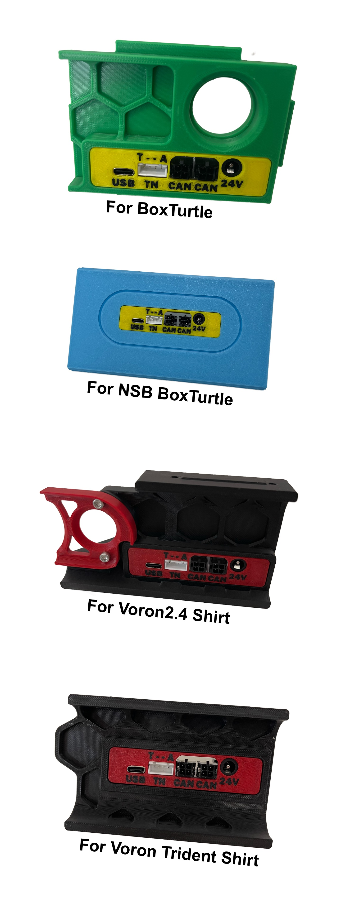

# MMU-IO-Board
This is an **MMU-IO-Board** compatible with **BoxTurtle BTIO**, but it is **not an official BoxTurtle product**. Please make sure to double-check the **PINOUT**.

I found the idea of this IO board very useful, so I remixed the model to support both **Voron 2.4 / Trident skirts** and the **BoxTurtle NSB**.

 If you need it, you can download the files from the **STL folder**.

